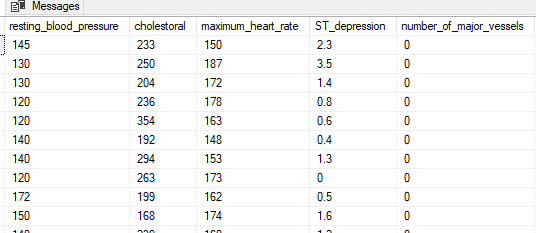

# Heart Attack Analysis


A heart attack is an urgent medical situation. It usually occurs when a blood clot obstructs the heart’s blood supply. Without blood, tissue dehydrates and deteriorates. Treatment may involve medications, medical procedures such as angioplasty or stent placement to open the blocked artery, and lifestyle changes to reduce the risk of future heart problems.

### Approach to the Project
In this article, I assume the role of a Healthcare Data Analyst and carry out exploratory data analysis of Heart Attack dataset of a hospital. From this analysis, insights on the causes of heart diseases is gotten. The dataset used in this analysis was gotten from [Kaggle](https://www.kaggle.com/datasets/rashikrahmanpritom/heart-attack-analysis-prediction-dataset), and it contains information such as: age, sex, resting blood pressure, exercise induced angina, number of major vessels, chest pain type, cholesterol, fasting blood sugar, resting electrocardiographic result, maximum heart rate, ST depression, thallium stress test, slope peak exercise and output.

I used MS SQL Server to clean the dataset and carry out the data exploration on the dataset.
This article is divided into several stages: data cleaning, data exploration, insights and recommendation stage.

---
### Data Cleaning

To gain insights from a dataset, it is important to ensure the dataset is clean enough for doing that. The data cleaning process involves handling missing values, correcting inconsistencies, and formatting the data for analysis. In this project, I ensured the dataset was thoroughly cleaned to ensure the accuracy and integrity of our findings.

1. Checking if there are duplicate rows

```sql
SELECT age, sex, cp, trtbps, chol, fbs, restecg, thalachh, exng, oldpeak, slp, caa, thall, output
FROM PersonalProject..HeartAttack 
GROUP BY age, sex, cp, trtbps, chol, fbs, restecg, thalachh, exng, oldpeak, slp, caa, thall, output
HAVING COUNT(*) > 1;
```


The duplicate row has to be removed to ensure accuracy

```sql
-- Dropping the duplicate row
WITH CTE AS (
  SELECT age, sex, cp, trtbps, chol, fbs, restecg, thalachh, exng, oldpeak, slp, caa, thall, output,
         ROW_NUMBER() OVER (PARTITION BY age, sex, cp, trtbps, chol, fbs, restecg, thalachh, exng, oldpeak, slp, caa, thall, output ORDER BY (SELECT 0)) AS RowNumber
  FROM PersonalProject..HeartAttack
)
DELETE FROM CTE WHERE RowNumber > 1;
```

2. Checking for null values

```sql
SELECT *
FROM PersonalProject..HeartAttack
WHERE age IS NULL 
 OR sex IS NULL 
 OR cp IS NULL 
 OR trtbps IS NULL 
 OR chol IS NULL 
 OR fbs IS NULL 
 OR restecg IS NULL 
 OR thalachh IS NULL 
 OR exng IS NULL 
 OR oldpeak IS NULL 
 OR slp IS NULL 
 OR caa IS NULL 
 OR thall IS NULL 
 OR output IS NULL;
```


*The query returns an empty table, showing there are no null values.*

3. Next step in the data cleaning stage is renaming of columns for better readability and understanding.

The columns to be renamed are : cp, trtbps, chol, fbs, restecg, thalachh, exng, oldpeak, slp, caa, thall
```sql
BEGIN TRANSACTION;

EXEC sp_rename 'PersonalProject..HeartAttack.cp', 'chest_pain_type', 'COLUMN';
EXEC sp_rename 'PersonalProject..HeartAttack.trtbps', 'resting_blood_pressure', 'COLUMN';
EXEC sp_rename 'PersonalProject..HeartAttack.chol', 'cholestoral', 'COLUMN';
EXEC sp_rename 'PersonalProject..HeartAttack.fbs', 'fasting_blood_sugar', 'COLUMN';
EXEC sp_rename 'PersonalProject..HeartAttack.restecg', 'resting_electrocardiographic', 'COLUMN';
EXEC sp_rename 'PersonalProject..HeartAttack.thalachh', 'maximum_heart_rate', 'COLUMN';
EXEC sp_rename 'PersonalProject..HeartAttack.exng', 'exercise_induced_angina', 'COLUMN';
EXEC sp_rename 'PersonalProject..HeartAttack.oldpeak', 'ST_depression', 'COLUMN';
EXEC sp_rename 'PersonalProject..HeartAttack.slp', 'slope_peak_exercise', 'COLUMN';
EXEC sp_rename 'PersonalProject..HeartAttack.caa', 'number_of_major_vessels', 'COLUMN';
EXEC sp_rename 'PersonalProject..HeartAttack.thall', 'thalium_stress_test', 'COLUMN';

COMMIT;
```
Viewing renamed columns:
```sql
SELECT *
FROM PersonalProject..HeartAttack
```

*a section of renamed columns*

4. Adding feature values to the columns. This will aid better understanding of the dataset. For the other columns where feature values will be added, new columns has to be created for them and then the feature values added
```sql
--Adding feature values for sex

ALTER TABLE PersonalProject..HeartAttack
ADD sex_new VARCHAR(50);

UPDATE PersonalProject..HeartAttack
SET sex_new = CASE
    WHEN sex = 0 THEN 'Female'
    WHEN sex = 1 THEN 'Male'
    END;

-- Dropping the old column
ALTER TABLE PersonalProject..HeartAttack
DROP COLUMN sex;

-- Rename the new column
EXEC sp_rename 'PersonalProject..HeartAttack.sex_new', 'sex', 'COLUMN';
--Adding feature values for chest_pain_type
ALTER TABLE PersonalProject..HeartAttack
ADD chest_pain_type_new VARCHAR(50);

UPDATE PersonalProject..HeartAttack
SET chest_pain_type_new = CASE
    WHEN chest_pain_type = 0 THEN 'typical angina'
    WHEN chest_pain_type = 1 THEN 'atypical angina'
    WHEN chest_pain_type = 2 THEN 'non-anginal pain'
 WHEN chest_pain_type = 3 THEN 'asymptomatic'
    END;

-- Dropping the old column
ALTER TABLE PersonalProject..HeartAttack
DROP COLUMN chest_pain_type;

-- Rename the new column
EXEC sp_rename 'PersonalProject..HeartAttack.chest_pain_type_new', 'chest_pain_type', 'COLUMN';


-- Adding feature values for fasting_blood_sugar

ALTER TABLE PersonalProject..HeartAttack
ADD fasting_blood_sugar_new VARCHAR(50);

UPDATE PersonalProject..HeartAttack
SET fasting_blood_sugar_new = CASE
    WHEN fasting_blood_sugar = 0 THEN '<120 mg/dl'
    WHEN fasting_blood_sugar = 1 THEN '>120 mg/dl'
    END;

-- Dropping the old column
ALTER TABLE PersonalProject..HeartAttack
DROP COLUMN fasting_blood_sugar;

-- Rename the new column
EXEC sp_rename 'PersonalProject..HeartAttack.fasting_blood_sugar_new', 'fasting_blood_sugar', 'COLUMN';


-- Adding feature values for  resting_electrocardiographic
ALTER TABLE PersonalProject..HeartAttack
ADD resting_electrocardiographic_new VARCHAR(50);

UPDATE PersonalProject..HeartAttack
SET resting_electrocardiographic_new = CASE
    WHEN resting_electrocardiographic = 0 THEN 'normal'
    WHEN resting_electrocardiographic = 1 THEN 'ST-T wave abnormality'
    WHEN resting_electrocardiographic = 2 THEN 'ventricular hypertrophy'
    END;

-- Dropping the old column
ALTER TABLE PersonalProject..HeartAttack
DROP COLUMN resting_electrocardiographic;

-- Rename the new column
EXEC sp_rename 'PersonalProject..HeartAttack.resting_electrocardiographic_new', 'resting_electrocardiographic', 'COLUMN';


-- Adding feature values for exercise_induced_angina
ALTER TABLE PersonalProject..HeartAttack
ADD exercise_induced_angina_new VARCHAR(50);

UPDATE PersonalProject..HeartAttack
SET exercise_induced_angina_new = CASE
    WHEN exercise_induced_angina = 0 THEN 'no'
    WHEN exercise_induced_angina = 1 THEN 'yes'
    END;

-- Dropping the old column
ALTER TABLE PersonalProject..HeartAttack
DROP COLUMN exercise_induced_angina;

-- Rename the new column
EXEC sp_rename 'PersonalProject..HeartAttack.exercise_induced_angina_new', 'exercise_induced_angina', 'COLUMN';


-- Adding feature values for slope_peak_exercise
ALTER TABLE PersonalProject..HeartAttack
ADD slope_peak_exercise_new VARCHAR(50);

UPDATE PersonalProject..HeartAttack
SET slope_peak_exercise_new = CASE
    WHEN slope_peak_exercise = 0 THEN 'upsloping'
    WHEN slope_peak_exercise = 1 THEN 'flat'
    WHEN slope_peak_exercise = 2 THEN 'downsloping'
    END;

-- Dropping the old column
ALTER TABLE PersonalProject..HeartAttack
DROP COLUMN slope_peak_exercise;

-- Rename the new column
EXEC sp_rename 'PersonalProject..HeartAttack.slope_peak_exercise_new', 'slope_peak_exercise', 'COLUMN';


-- Adding feature values for thalium_stress_test
ALTER TABLE PersonalProject..HeartAttack
ADD thalium_stress_test_new VARCHAR(50);

UPDATE PersonalProject..HeartAttack
SET thalium_stress_test_new = CASE
    WHEN thalium_stress_test = 0 THEN 'normal 0'
    WHEN thalium_stress_test = 1 THEN 'normal 1'
    WHEN thalium_stress_test = 2 THEN 'fixed defect'
 WHEN thalium_stress_test = 3 THEN 'reversible defect'
    END;

-- Dropping the old column
ALTER TABLE PersonalProject..HeartAttack
DROP COLUMN thalium_stress_test;

-- Rename the new column
EXEC sp_rename 'PersonalProject..HeartAttack.thalium_stress_test_new', 'thalium_stress_test', 'COLUMN';


-- Adding feature values for output
ALTER TABLE PersonalProject..HeartAttack
ADD output_new VARCHAR(50);

UPDATE PersonalProject..HeartAttack
SET output_new = CASE
    WHEN output = 0 THEN 'no disease'
    WHEN output = 1 THEN 'disease'
    END;

-- Dropping the old column
ALTER TABLE PersonalProject..HeartAttack
DROP COLUMN output;

-- Rename the new column
EXEC sp_rename 'PersonalProject..HeartAttack.output_new', 'output', 'COLUMN';
```



*Feature values added to renamed columns*

5. I noticed that the name I gave to some columns were wrong, so I had to rename it to the right name.
```sql
EXEC sp_rename 'PersonalProject..HeartAttack.cholestoral', 'cholesterol', 'COLUMN'
EXEC sp_rename 'PersonalProject..HeartAttack.thalium_stress_test', 'thallium_stress_test', 'COLUMN'
```


---
### Data Exploration

Answering business questions.

1. What is the average age of patients?
```sql
SELECT CAST(AVG(age) AS INTEGER) as AverageAge
FROM PersonalProject..HeartAttack
```


The average age of patients in this dataset is 54.

2. What is the number of male and female patients?
```sql
SELECT sex, COUNT(*) AS TotalNumberOfPatients
FROM PersonalProject..HeartAttack
GROUP BY sex
```


The number of male and female patients is 206 and 96, respectively. This shows that more male patients were recorded than females for this analysis.

3. What is the result of the thallium_stress_test for each sex?
```sql
SELECT sex, thallium_stress_test, COUNT(thallium_stress_test) AS TotalThalliumStressTest
FROM PersonalProject..HeartAttack
GROUP BY sex, thallium_stress_test
ORDER BY sex
```


The result suggests that there are more male patients that have reduced blood flow during exercise (and at rest) compared to the female patients.

4. Which sex had the most patients with heart diseases?
```sql
SELECT sex, COUNT(*) AS CountDisease
FROM PersonalProject..HeartAttack
WHERE output = 'disease'
GROUP BY sex
ORDER BY CountDisease DESC;
```


From the results, it shows that there are more male patients with heart diseases than there are female patients.

5. Which sex has the highest cholesterol level?
```sql
SELECT sex, CAST(AVG(cholesterol) AS INTEGER) AS AverageCholesterol
FROM PersonalProject..HeartAttack
GROUP BY sex
ORDER BY AverageCholesterol DESC;
```


Female patients were found to have the highest cholesterol level among both sexes.

6. What Chest pain type resulted more in no heart disease?
```sql
SELECT chest_pain_type, COUNT(*) AS CountofNoDisease
FROM PersonalProject..HeartAttack
WHERE output = 'no disease'
GROUP BY chest_pain_type
```


Amongst the four types of chest pain the patients had, typical angina chest pain mostly resulted to no heart disease.

7. Which thallium stress test led to higher incidence of heart disease?
```sql
SELECT thallium_stress_test, COUNT(*) AS DiseaseCount
FROM PersonalProject..HeartAttack
WHERE output = 'disease'
GROUP BY thallium_stress_test
ORDER BY DiseaseCount DESC
```


Patients with fixed defect were diagnosed with a heart disease.

8. Is there a relationship between the number of major vessels healthy and the occurrence of heart disease?
```sql
SELECT number_of_major_vessels, COUNT(*) AS DiseaseCount
FROM PersonalProject..HeartAttack
WHERE output = 'disease'
GROUP BY number_of_major_vessels
ORDER BY number_of_major_vessels;
```


There is a negative correlation between number of major vessels healthy and the occurrence of heart disease. The higher the number of healthy major vessels, the lesser the occurrence of heart disease.

---
## Insights
- The average age of patients is 54
- The number of male and female patients are 206 and 96, respectively.
- There are more male patients that have reduced blood flow during exercise (and at rest) compared to the females.
- There are more male patients with heart disease than there are female patients.
- Female patients have higher cholesterol level compared to the male patients.
- Most patients that had the typical angina chest pain did not have an heart disease.
- Fixed defect — a reduced or absent thallium both during exercise and at rest- resulted to the most incidence of heart diseases
- The higher the number of healthy major vessels, the lesser the occurrence of heart disease and vice-versa
- Patients with lower or no healthy major vessels were more likely to have a heart disease.

---
## Recommendations
1. Females should be advice to reduce their cholesterol consumption to no more than 300mg per day. They should also be adviced to focus on maintaining a heart-healthy diet that includes a variety of fruits, vegetables, whole grains, lean proteins, and healthy fats.
2. Medications, improved lifestyle, revascularization — which is done to restore normal blood flow to affected areas of the body and cardiac rehabilitation programs that involve exercise, education, and support can help improve heart health and manage the condition.
3. More attention should be placed on the male patients to help improve their heart health and prevent occurences that could lead to heart diseases/attack.

---
By implementing these recommendations, the hospital can help improve the heart health of her patients and manage the condition of patients already diagnosed with a heart disease.

---
Thank you for reading this article.
